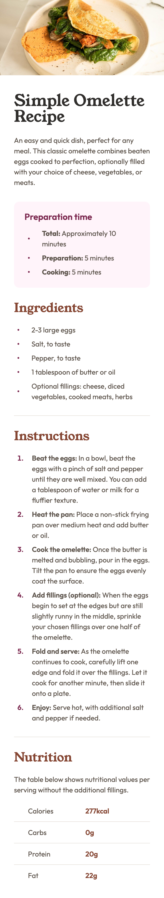
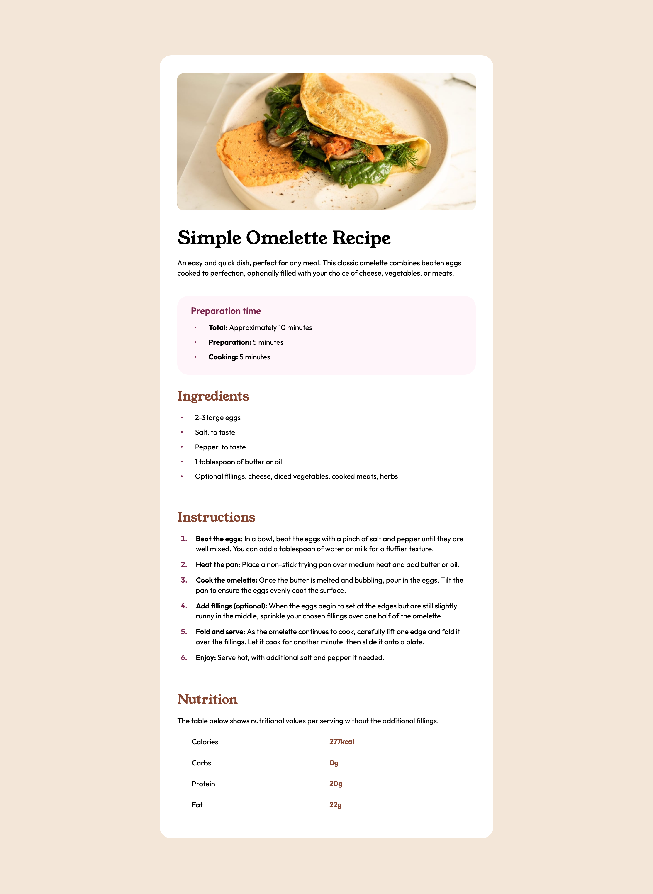

# Frontend Mentor - Recipe page solution

This is a solution to the [Recipe page challenge on Frontend Mentor](https://www.frontendmentor.io/challenges/recipe-page-KiTsR8QQKm). Frontend Mentor challenges help you improve your coding skills by building realistic projects.

## Table of contents

- [Overview](#overview)
  - [The challenge](#the-challenge)
  - [Screenshot](#screenshot)
  - [Links](#links)
- [My process](#my-process)
  - [Built with](#built-with)
  - [What I learned](#what-i-learned)
  - [Continued development](#continued-development)
  - [Useful resources](#useful-resources)
- [Author](#author)
- [Acknowledgments](#acknowledgments)

## Overview

### Screenshot

|  Mobile designed at 375px:   |  Desktop designed at 1440px:  |
| :--------------------------: | :---------------------------: |
|  |  |

### Links

- Solution URL: [https://github.com/elisilk/recipe-page](https://github.com/elisilk/recipe-page)
- Live Site URL: [Add live site URL here](https://your-live-site-url.com)

## My process

### Built with

- Semantic HTML5 markup
- CSS custom properties
- Flexbox
- CSS Grid
- Mobile-first workflow

**Note: These are just examples. Delete this note and replace the list above with your own choices**

### What I learned

Use this section to recap over some of your major learnings while working through this project. Writing these out and providing code samples of areas you want to highlight is a great way to reinforce your own knowledge.

- [Full Width Containers in Limited Width Parents](https://css-tricks.com/full-width-containers-limited-width-parents/)
- [All page content should be contained by landmarks](https://dequeuniversity.com/rules/axe/4.6/region?application=axeAPI)
- [Grid Wrapper](https://developer.mozilla.org/en-US/docs/Web/CSS/Layout_cookbook/Grid_wrapper)
- [Perfect Pixel](https://chromewebstore.google.com/detail/perfectpixel-by-welldonec/dkaagdgjmgdmbnecmcefdhjekcoceebi)
- [Comments on my QR code component solution](https://www.frontendmentor.io/solutions/card-component-using-bem-and-css-custom-properties-4MgLuLV-0M)
- Thank you [@Ezekiel225](https://www.frontendmentor.io/profile/Ezekiel225)
- [Effective Collaboration with Product and Design](https://www.joshwcomeau.com/career/effective-collaboration/)
- [Chasing the Pixel-Perfect Dream](https://www.joshwcomeau.com/css/pixel-perfection/)
- [Adding border bottom to a table row](https://stackoverflow.com/questions/10040842/add-border-bottom-to-table-row-tr)
- Vertical alignment/centering of bullets in list, such as [these flex solutions](https://css-tricks.com/forums/topic/how-do-i-vertically-align-custom-bullets-to-the-middle-of-the-list-content/) that [used the :before marker](https://stackoverflow.com/questions/69874236/how-can-i-vertically-align-a-list-item-marker); making sure the [flex-shrink property is set properly](https://developer.mozilla.org/en-US/docs/Web/CSS/flex-shrink)
- [How to break an image out of its parent container with CSS](https://gomakethings.com/how-to-break-an-image-out-of-its-parent-container-with-css/)
- rem vs. em vs. px such as [this resource](https://css-tricks.com/rems-ems/), or [this one](https://j.eremy.net/confused-about-rem-and-em/), or [this one that includes accessibility considerations](https://www.joshwcomeau.com/css/surprising-truth-about-pixels-and-accessibility/)
- run my own validators for HTML, CSS and accessibility?
- think about better specifying the adjustments from the system using concepts like inherited property values [for example](https://stackoverflow.com/questions/21605946/how-can-i-use-css-calc-with-inherit) or [this shifty translation idea](https://www.joshwcomeau.com/css/pixel-perfection/#a-shifty-component-4)

To see how you can add code snippets, see below:

```html
<h1>Some HTML code I'm proud of</h1>
```

```css
.proud-of-this-css {
  color: papayawhip;
}
```

```js
const proudOfThisFunc = () => {
  console.log("🎉");
};
```

If you want more help with writing markdown, we'd recommend checking out [The Markdown Guide](https://www.markdownguide.org/) to learn more.

**Note: Delete this note and the content within this section and replace with your own learnings.**

### Continued development

Use this section to outline areas that you want to continue focusing on in future projects. These could be concepts you're still not completely comfortable with or techniques you found useful that you want to refine and perfect.

**Note: Delete this note and the content within this section and replace with your own plans for continued development.**

### Useful resources

- Focusing a lot on semantic HTML and considering [which resources are the best ones to use](https://www.google.com/search?q=semantic+html) to understand how to structure the tags in this challenge; (web.dev has a nice overview)[https://web.dev/learn/html/semantic-html]
- Considering whether to try to extend the image to the full width of the container using [some CSS trickery](https://css-tricks.com/full-width-containers-limited-width-parents/) or if that doesn't make sense here because it's not the full width of the entire view, and because I can organize my divs so this kind of fix is not necessary.
- [Example resource 1](https://www.example.com) - This helped me for XYZ reason. I really liked this pattern and will use it going forward.
- [Example resource 2](https://www.example.com) - This is an amazing article which helped me finally understand XYZ. I'd recommend it to anyone still learning this concept.

**Note: Delete this note and replace the list above with resources that helped you during the challenge. These could come in handy for anyone viewing your solution or for yourself when you look back on this project in the future.**

## Author

- Website - [Add your name here](https://www.your-site.com)
- Frontend Mentor - [@yourusername](https://www.frontendmentor.io/profile/yourusername)
- Twitter - [@yourusername](https://www.twitter.com/yourusername)

**Note: Delete this note and add/remove/edit lines above based on what links you'd like to share.**

## Acknowledgments

This is where you can give a hat tip to anyone who helped you out on this project. Perhaps you worked in a team or got some inspiration from someone else's solution. This is the perfect place to give them some credit.

**Note: Delete this note and edit this section's content as necessary. If you completed this challenge by yourself, feel free to delete this section entirely.**
