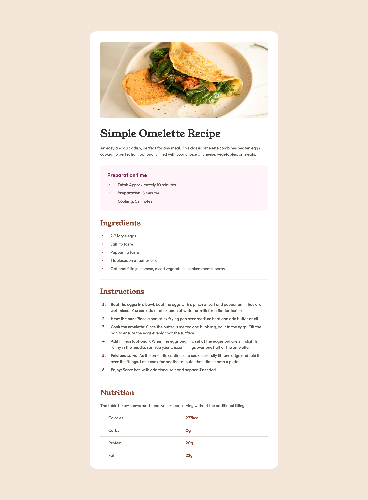

# Frontend Mentor - Recipe page solution

This is a solution to the [Recipe page challenge on Frontend Mentor](https://www.frontendmentor.io/challenges/recipe-page-KiTsR8QQKm). Frontend Mentor challenges help you improve your coding skills by building realistic projects.

## Table of contents

- [Overview](#overview)
  - [The challenge](#the-challenge)
  - [Screenshot](#screenshot)
  - [Links](#links)
- [My process](#my-process)
  - [Built with](#built-with)
  - [What I learned](#what-i-learned)
  - [Continued development](#continued-development)
  - [Useful resources](#useful-resources)
- [Author](#author)
- [Acknowledgments](#acknowledgments)

## Overview

### Screenshot

|  Mobile designed at 375px:   |  Desktop designed at 1440px:  |
| :--------------------------: | :---------------------------: |
|  |  |

### Links

- Solution URL: [https://github.com/elisilk/recipe-page](https://github.com/elisilk/recipe-page)
- Live Site URL: [https://elisilk.github.io/recipe-page/](https://elisilk.github.io/recipe-page/)

## My process

### Built with

- Semantic HTML5 markup
- CSS custom properties
- Flexbox
- CSS Grid
- Mobile-first workflow

### What I learned

In this section, I recap some of my major learnings while working through this project.

- [Full Width Containers in Limited Width Parents](https://css-tricks.com/full-width-containers-limited-width-parents/)
- [All page content should be contained by landmarks](https://dequeuniversity.com/rules/axe/4.6/region?application=axeAPI)
- [Grid Wrapper](https://developer.mozilla.org/en-US/docs/Web/CSS/Layout_cookbook/Grid_wrapper)
- [Perfect Pixel](https://chromewebstore.google.com/detail/perfectpixel-by-welldonec/dkaagdgjmgdmbnecmcefdhjekcoceebi)
- [Comments on my QR code component solution](https://www.frontendmentor.io/solutions/card-component-using-bem-and-css-custom-properties-4MgLuLV-0M)
- Thank you [@Ezekiel225](https://www.frontendmentor.io/profile/Ezekiel225)
- [Effective Collaboration with Product and Design](https://www.joshwcomeau.com/career/effective-collaboration/)
- [Chasing the Pixel-Perfect Dream](https://www.joshwcomeau.com/css/pixel-perfection/)
- [Adding border bottom to a table row](https://stackoverflow.com/questions/10040842/add-border-bottom-to-table-row-tr)
- Vertical alignment/centering of bullets in list, such as [these flex solutions](https://css-tricks.com/forums/topic/how-do-i-vertically-align-custom-bullets-to-the-middle-of-the-list-content/) that [used the :before marker](https://stackoverflow.com/questions/69874236/how-can-i-vertically-align-a-list-item-marker); making sure the [flex-shrink property is set properly](https://developer.mozilla.org/en-US/docs/Web/CSS/flex-shrink)
- rem vs. em vs. px such as [this resource](https://css-tricks.com/rems-ems/), or [this one](https://j.eremy.net/confused-about-rem-and-em/), or [this one that includes accessibility considerations](https://www.joshwcomeau.com/css/surprising-truth-about-pixels-and-accessibility/)
- run my own validators for HTML, CSS and accessibility?
- think about better specifying the adjustments from the system using concepts like inherited property values [for example](https://stackoverflow.com/questions/21605946/how-can-i-use-css-calc-with-inherit) or [this shifty translation idea](https://www.joshwcomeau.com/css/pixel-perfection/#a-shifty-component-4)

One CSS aspect that I found fun to implement was placing the top recipe image outside of its parent container (the wrapper class) so that it spanned the full width of the viewport (at least in the mobile version). I found these two resources exactly what I needed:

- [How to break an image out of its parent container with CSS](https://gomakethings.com/how-to-break-an-image-out-of-its-parent-container-with-css/)
- Extending the image to the full width of the container using [some CSS trickery](https://css-tricks.com/full-width-containers-limited-width-parents/)

And here is the CSS:

```css
.recipe__image {
  left: 50%;
  margin-left: -50vw;
  margin-right: -50vw;
  max-width: 100vw;
  position: relative;
  right: 50%;
  width: 100vw;
}
```

### Continued development

I definitely want to think more clearly about a design system that specifies the font sizes, margins, paddings, etc. and that balances the desire to get pixel perfection relative to the design with the goal of a robust system that would be easy to maintain and scale. Relatedly, I want to think more clearly (and have better intuition) about when to use px vs em vs rem.

### Useful resources

- I focused a bit on semantic HTML and considering [which resources are the best ones to use](https://www.google.com/search?q=semantic+html) to understand how to structure the tags in this challenge; (web.dev has a nice overview)[https://web.dev/learn/html/semantic-html]

## Author

- Website - [Eli Silk](https://github.com/elisilk)
- Frontend Mentor - [@elisilk](https://www.frontendmentor.io/profile/elisilk)

## Acknowledgments

Thank you [@Ezekiel225](https://www.frontendmentor.io/profile/Ezekiel225) for encouraging me to use work more towards Pixel Perfection in my work with these challenges.
